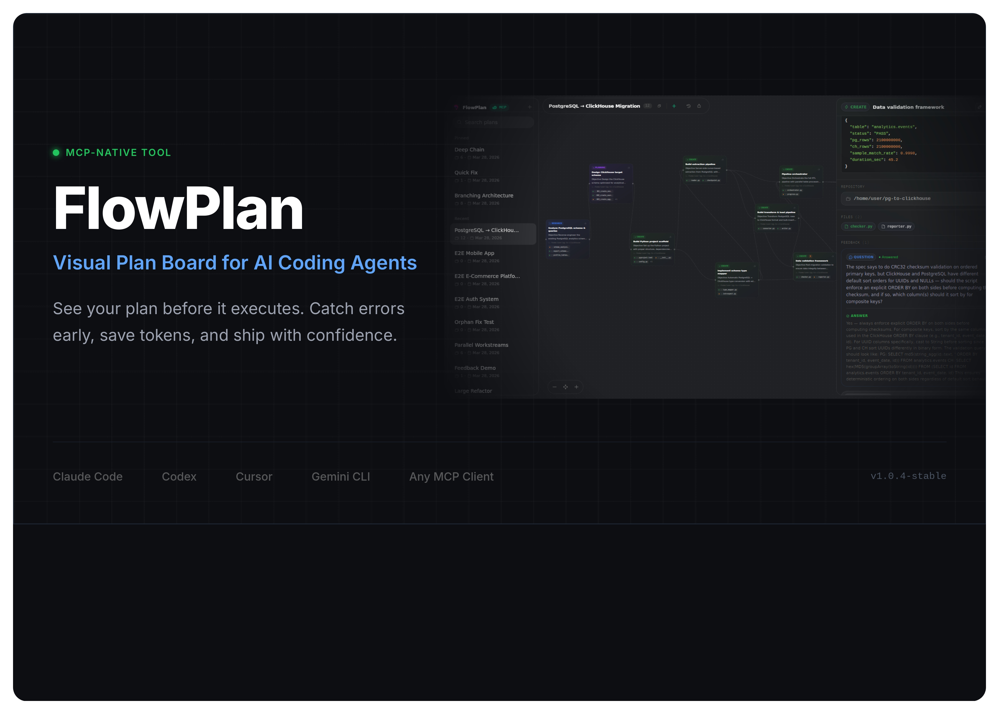

# FlowPlan

A visual plan board for AI coding agents. FlowPlan connects to Claude Code, Codex, Cursor, Gemini CLI, and other MCP-compatible agents via MCP (Model Context Protocol), turning their execution plans into interactive flow diagrams with dependency connections, file change previews, and a two-way feedback system.

**[Website](https://bariskau.github.io/flowplan)**

<p align="center">
  
</p>
<p align="center">
  
  
</p>

## Features

- **Interactive flow diagrams** — Cards lay out as a dependency graph. Drag, zoom, pan, connect cards by dragging handles.
- **File change previews** — Each card lists affected files with proposed code changes. Click to open a syntax-highlighted code viewer.
- **Two-way feedback** — Right-click cards to leave Questions, Directives, or Issues. The agent responds through MCP.
- **Copy references** — Every card has a "Copy ref" button. Paste the reference into your agent's chat to target specific cards.
- **History timeline** — Every change is recorded. Scrub through history with visual diff highlights on the canvas.
- **5 card types** — Research, Planning, Create, Edit, Test. Color-coded for instant readability.
- **Export & Import** — SVG for documentation, JSON for backup and sharing.
- **12 MCP tools** — `create_plan`, `add_cards`, `update_card`, `remove_card`, `get_cards`, `get_plan`, `list_plans`, `clear_plan`, `reorder_cards`, `get_all_feedback`, `answer_feedback`, `acknowledge_feedback`.

## Quick Start

### Prerequisites
- Node.js 18+
- Rust: `curl --proto '=https' --tlsv1.2 -sSf https://sh.rustup.rs | sh`
- Ubuntu: `sudo apt install libgtk-3-dev libwebkit2gtk-4.1-dev libjavascriptcoregtk-4.1-dev libsoup-3.0-dev libayatana-appindicator3-dev librsvg2-dev patchelf build-essential curl wget file libxdo-dev libssl-dev`
- macOS: `xcode-select --install`

### Build & Run

```bash
npm install
npm run tauri:dev
```

The MCP server starts automatically at `http://localhost:3100/mcp` (Streamable HTTP).

### MCP Setup

Add FlowPlan to your agent's MCP config (`.mcp.json`):

```json
{
  "mcpServers": {
    "flowplan": {
      "type": "http",
      "url": "http://localhost:3100/mcp"
    }
  }
}
```

Or via CLI:

```bash
claude mcp add flowplan --transport http http://localhost:3100/mcp
codex mcp add flowplan --url http://localhost:3100/mcp
```

Any client supporting Streamable HTTP transport can connect to `http://localhost:3100/mcp`.

## License

MIT
