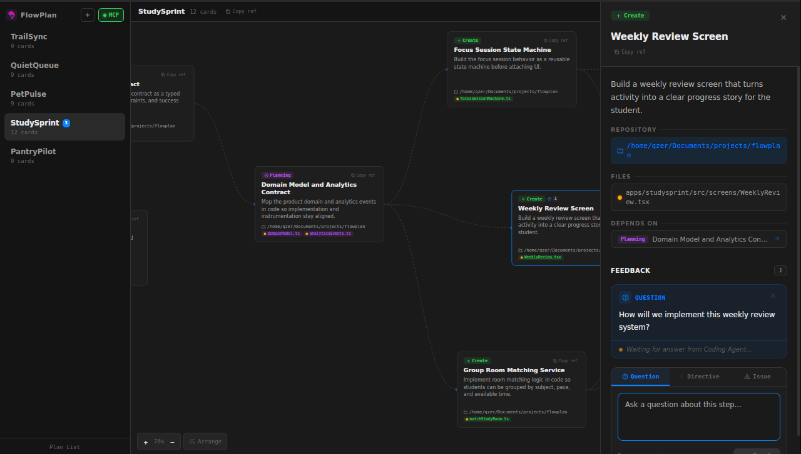
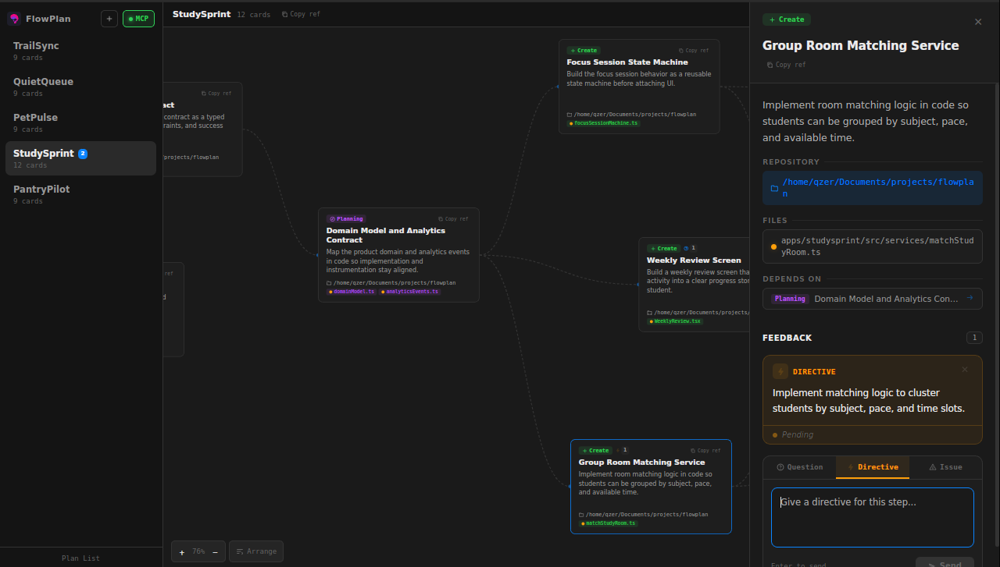
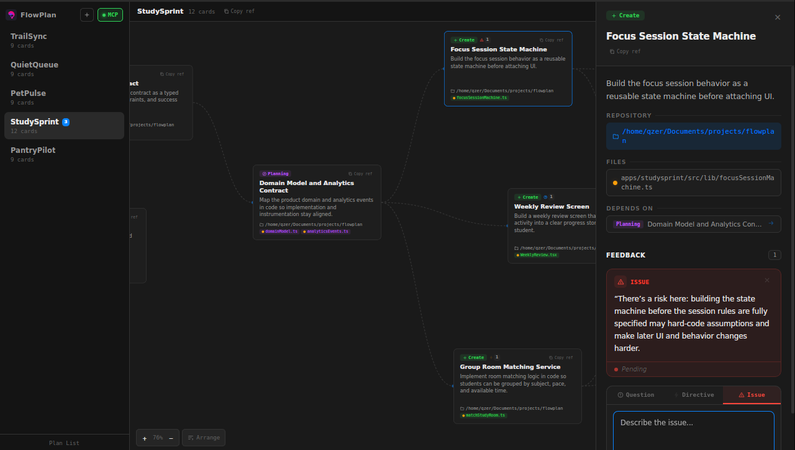

# FlowPlan

A visual plan board for AI coding agents. FlowPlan connects to Claude Code, Codex, and other MCP-compatible agents via MCP (Model Context Protocol), turning their execution plans into interactive flow diagrams with dependency connections, file change previews, and a two-way feedback system.

Built with Tauri 2, React, and Rust.

<p align="center">
  
</p>
<p align="center">
  
  
</p>

## Quick Start

### Prerequisites
- Node.js 18+
- Rust: `curl --proto '=https' --tlsv1.2 -sSf https://sh.rustup.rs | sh`
- Ubuntu build deps:

```bash
sudo apt update
sudo apt install libgtk-3-dev libwebkit2gtk-4.1-dev libjavascriptcoregtk-4.1-dev \
  libsoup-3.0-dev libayatana-appindicator3-dev librsvg2-dev patchelf \
  build-essential curl wget file libxdo-dev libssl-dev
```

- macOS build deps: `xcode-select --install`

### Build & Run

```bash
npm install
npm run tauri:dev
```

The MCP server starts automatically at `http://localhost:3100/mcp` (Streamable HTTP).

### Production Build

```bash
npm run tauri:build
```

Platform-specific bundles are written under `src-tauri/target/release/bundle/`.

## MCP Setup

### Claude Code

Add FlowPlan as an MCP server in your project's `.mcp.json` or global config:

```json
{
  "mcpServers": {
    "flowplan": {
      "type": "http",
      "url": "http://localhost:3100/mcp"
    }
  }
}
```

Or add it via CLI:

```bash
claude mcp add flowplan --transport http http://localhost:3100/mcp
```

### OpenAI Codex

Add to your Codex MCP configuration:

```json
{
  "mcpServers": {
    "flowplan": {
      "type": "http",
      "url": "http://localhost:3100/mcp"
    }
  }
}
```

Or add it via CLI:

```bash
codex mcp add flowplan --url http://localhost:3100/mcp
```

### Other MCP Clients

Any client supporting Streamable HTTP transport can connect to `http://localhost:3100/mcp`.

## Usage Scenarios

### 1. Starting a New Plan

Tell the agent:

> "Create a plan in FlowPlan for adding user authentication to this project. Break it down into research, implementation, and testing steps."

The agent will call `create_plan` to create the board, then `add_cards` to populate it with steps. Each card gets a type (research, planning, create, edit, test), file list, and dependency connections.

### 2. Planning with File Changes

> "Create a FlowPlan for refactoring the database layer. For each step, include the proposed code changes for every file."

The agent includes `file_changes` with each card -- diffs or full content that users can preview by clicking files in the UI. This is the recommended workflow: every file listed on a card should have an associated file change entry.

### 3. Iterative Plan Updates

> "Look at the current FlowPlan board. Update card X to include the new middleware file, and add a new testing step that depends on it."

The agent calls `get_cards` to read the current state, then `update_card` / `add_card` to modify the plan. All changes are tracked in the history timeline.

### 4. Copying References for the Agent

Every plan and card has a "Copy ref" button. Clicking it copies a structured reference to your clipboard that you can paste directly into the agent's chat.

**Plan reference** (from the plan header):
```
[FlowPlan] "Auth Refactor" (plan-1234567890-0001)
```

**Card reference** (from a card or detail drawer):
```
[FlowPlan] "Auth Refactor" (plan-1234567890-0001) > "Add JWT middleware" (card-1234567890-0002)
```

Use these when talking to the agent:

> "Update this card: [FlowPlan] "Auth Refactor" (plan-123) > "Add JWT middleware" (card-456) -- add error handling for expired tokens."

> "Add a new test step to [FlowPlan] "Auth Refactor" (plan-123) that depends on the middleware card."

The agent can parse the plan ID and card ID from the reference to call `update_card`, `add_card`, or any other tool targeting that specific plan/card.

### 5. Asking Questions via Feedback (Question)

In FlowPlan, right-click a card and select "Add Feedback" with type **Question**:

> "Should we use JWT or session-based auth here?"

Then tell the agent:

> "Check FlowPlan for any pending feedback and answer the questions."

The agent calls `get_all_feedback`, sees the question, and calls `answer_feedback` with its response. The answer appears under the question in the FlowPlan UI.

### 6. Giving Directives (Directive)

Add a **Directive** feedback on a card:

> "Use PostgreSQL instead of SQLite for this step."

Then tell the agent:

> "Check FlowPlan feedback. Follow any directives and update the plan accordingly."

The agent reads the directive, updates the relevant cards, then calls `acknowledge_feedback` to mark it as processed. The directive shows a green "Acknowledged" badge in the UI.

### 7. Reporting Issues (Issue)

Add an **Issue** feedback on a card:

> "This step is missing error handling for the API timeout case."

The agent picks it up via `get_all_feedback`, addresses the issue by updating the card, and acknowledges it.

### 8. Reviewing Plan History

Click the clock icon in the header to open the history timeline. Each entry shows what changed:
- **Green** highlighted cards = newly added
- **Orange** highlighted cards = modified (title, description, files, or dependencies changed)
- Removed cards listed in the panel

Click any history entry to see the diff and highlight affected cards on the canvas.

### 9. Exporting the Plan

Click the download icon in the header to export the current plan as an SVG file. The export includes all cards with their types, file lists, and dependency connections. Saved to `~/Downloads/`.

## MCP Tools Reference

| Tool | Description |
|------|-------------|
| `create_plan` | Create a new plan board. Returns `planId`. |
| `add_cards` | Add one or more cards. Returns `cardIds[]` in order. |
| `remove_card` | Remove a card by ID. |
| `update_card` | Update card fields (title, description, type, files, dependencies, file_changes, order). |
| `get_cards` | Get cards (without file_changes content). Supports pagination. |
| `get_plan` | Get plan with all cards (without file_changes content). |
| `list_plans` | List all plans with IDs and card counts. |
| `clear_plan` | Remove all cards from a plan. |
| `reorder_cards` | Set display order for cards. |
| `get_all_feedback` | Get pending feedback items. |
| `answer_feedback` | Answer a question feedback. |
| `acknowledge_feedback` | Mark directive/issue as read. |

## Card Types

| Type | Purpose | Color |
|------|---------|-------|
| `research` | Investigation, analysis, reading docs | Purple |
| `planning` | Architecture decisions, design | Blue |
| `create` | New files, new features | Green |
| `edit` | Modify existing code | Orange |
| `test` | Testing, validation | Red |

## Feedback Workflow

1. User adds feedback on a card (**Question**, **Directive**, or **Issue**)
2. Agent calls `get_all_feedback` → sees pending items
3. Based on feedback type:

| Type | Agent action | Result |
|------|-------------|--------|
| **Question** | Calls `answer_feedback(id, answer)` | Answer appears in UI, marked as read |
| **Directive** | Follows instruction, updates plan, then calls `acknowledge_feedback([id])` | Shows "Acknowledged" badge in UI |
| **Issue** | Fixes the problem, updates cards, then calls `acknowledge_feedback([id])` | Shows "Acknowledged" badge in UI |

## License
All rights reserved. For licensing inquiries, contact the author.
